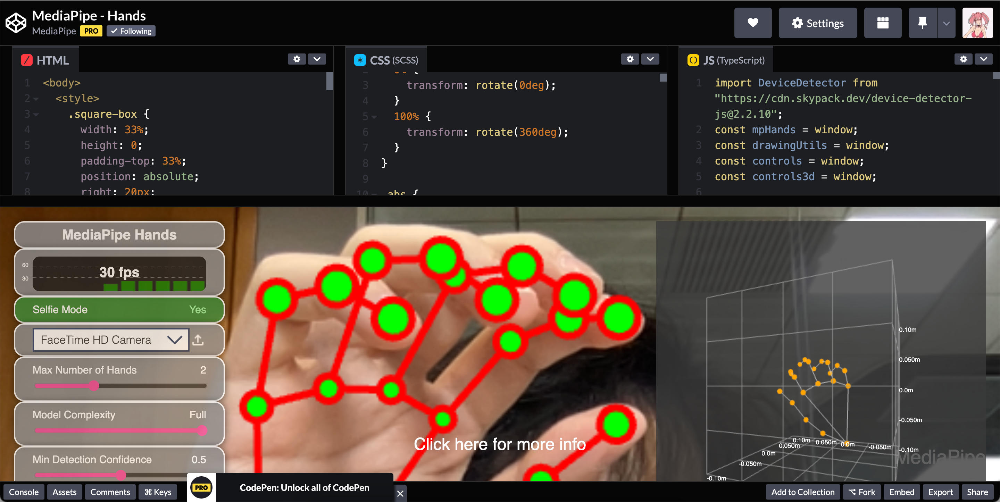
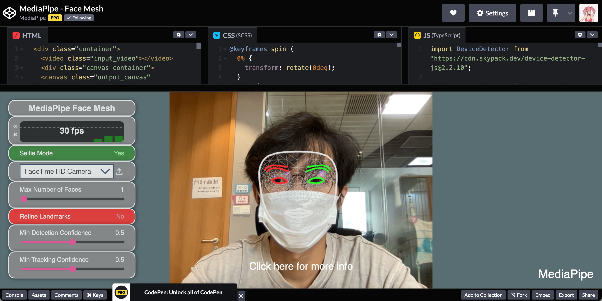
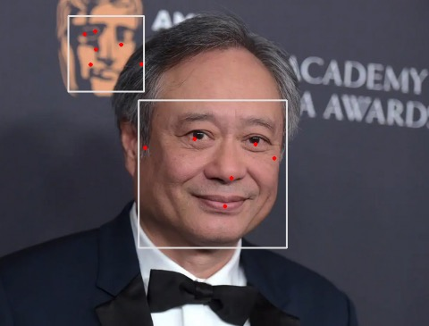

## 什么是机器学习?
简单来说机器学习就是用已知数据源来训练推理出模型的过程,训练出来的模型可以让我们在常规的数据上作出预测

## 端侧机器学习
当讨论到机器学习时,大部分人首先想到的是拥有强大的gpu的高性能服务器上才能运行,但是近年来随着移动端设备算力的发展,设备端机器学习迎来快速发展期

## 设备端的机器学习优势
- 更低的延迟 ( 不用与服务器交换数据, 计算都在本地完成
- 可离线操作 (在一些没有网络的地方也可以使用
- 避免隐私数据的上传 

## 一些应用场景
- 即时的语音唤醒
- 视频图片的图像分割
- 智能驾驶
- AR试妆
- 视频会议背景替换

## MediaPipe:
Google推出的一套开源的跨平台端侧机器学习解决方案,无需提前掌握机器学习的专业知识,可在端侧部署,支持Android,ios,浏览器 
https://mediapipe.dev/ 

**手部识别**
https://codepen.io/mediapipe/pen/RwGWYJw

**面部识别**
https://codepen.io/mediapipe/pen/KKgVaPJ

## Google colab
可让你在浏览器上以Jupyter Notebook 的互动式介面，来撰写及执行Python; 代码会在Google的服务器上运行; 
这里有个例子使用了Mediapipe已经训练好的模型进行面部识别: 
https://colab.research.google.com/drive/1ooq4Xjibci7blF9ivkU-GsPde9EKzM99?usp=sharing 
图片处理前:  

处理后: 

